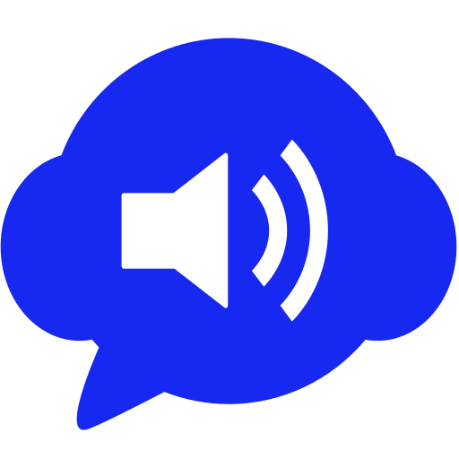
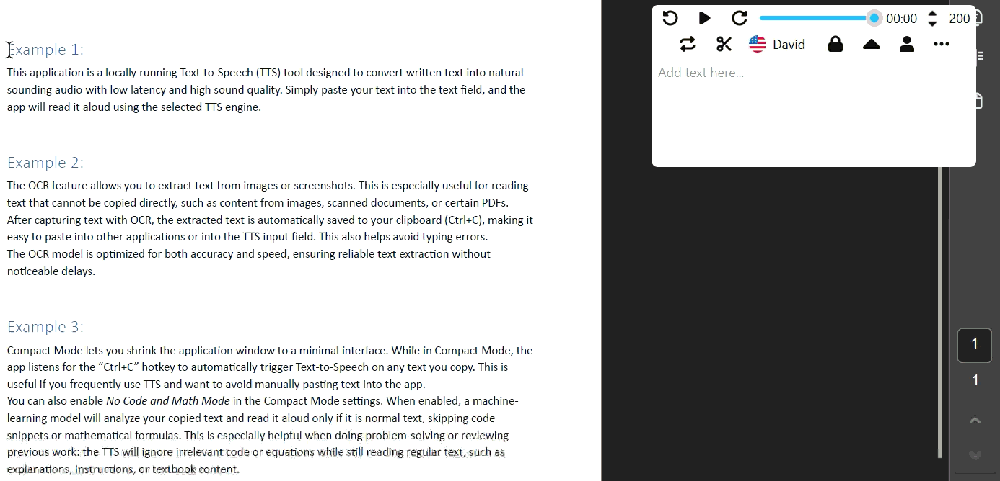

  

  <h1 align="center">Axiom TTS</h1>

  
  
  
  

---

Axiom TTS is a locally run Text-to-Speech (TTS) application that converts text into natural-sounding audio with low latency and high sound quality. It also includes built-in Optical Character Recognition (OCR), enabling it to extract and read text from images and PDF files.

Optimized for standard consumer hardware, Axiom TTS requires no technical expertise to install or operate. Its interface is designed to be clean, intuitive, and user-friendly.

For a quick overview and a minimal demonstration of Axiom TTS, visit the [official website](https://axiomsoftwareaps.github.io/Axiom-TTS/). It provides a concise presentation of the product and its core features.

## Contents

* [Basic Demo](#basic-demo)
* [Installation](#installation)
* [Enhanced Demo](#enhanced-demo)
* [Buying License](#Buying-license)
* [Product vision](#product-vision)

## Basic Demo

## Installation
**Click the button below or use this [link](xxx) to download the installer**. 

  

Please note that the current version of the application is available for Windows only. Upon installation, you’ll receive a 14-day free trial with access to all features. 

## Enhanced Demo
Here’s an enhanced demo showcasing the features and functionalities of Axiom TTS. Below is a list of the different sections covered in this demo:

  

  - [Fast Key Features](#fast-keys)
  - [Reading speed](#reading-speed)
  - [Pin/lock window](#pinlock-window)
  - [Text filters](#text-filters)
  - [Image to Text (OCR)](#image-to-text-ocr)
  - [Styling options](#styling-options)
  - [Compact mode](#compact-mode)
  - [Options for compact mode](#options-for-compact-mode)

### Fast Keys
Axiom TTS offers two types of fast key features:

  1. Global Fast Keys – These shortcuts work even when working in other application windows.  
  2. Application-Specific Fast Keys – These shortcuts work only when Axiom TTS is the active window, meaning it is the window last selected either by clicking on it or using Alt+Tab to switch to it.

**Fast Keys for the Text Box Window**
These shortcuts operate within the text box window:

  - Transform text into audio and play aloud:
    - Left click inside the text box to read the text aloud.
    - Press Ctrl+Enter to start reading the text aloud.

**General Shortcuts**
These shortcuts work even when using other applications:
  - Pause/Resume currently playing audio:
    - Press "Ctrl+Space" to pause or resume the audio.

### Reading speed
The reading speed is adjustable in words per minute (WPM) to suit your preferences, allowing you to control how fast or slow the text is read aloud. You can change the speed in the upper-right corner of the application, in intervals of 25 WPM.

Axiom TTS also includes an intelligent speed-adjustment feature: if more than 30 seconds remain in the currently playing audio when you change the speed, the application automatically regenerates the audio using the new settings. This improves the user experience by avoiding unnecessary full regenerations and allowing you to quickly speed up sections of text that require less effort to process.

### Pin/lock window
<table>
<tr>
<td width="80%" valign="top">

The pin/lock window feature keeps the application window on top of all other windows, making it easy to access the TTS controls while working in other applications. When unpinned, the window behaves normally and can move behind other windows as needed. You can toggle this feature at any time by clicking the lock icon.
</td>
<td width="10%" valign="top" align="center">

  

</td>

<td width="10%" valign="top" align="center">

  

</td>
</tr>
</table>

### Text filters
Text filters allow you to clean and adjust the text before it is read aloud. This is useful for removing unwanted characters or formatting that may disrupt the listening experience. The available filters include:

**Remove nothing:**  
The default option. Reads the text exactly as provided.

**Remove line breaks:**  
Removes line breaks and extra spaces. This is especially helpful when reading text formatted in columns, such as content from research papers or articles, where line breaks can interrupt the natural flow.
  
**Remove LaTeX:**  
Some websites such as Wikipedia use LaTeX for mathematical expressions and equations. This filter removes LaTeX code, ensuring a smoother reading experience without interruptions from complex formatting.

**Remove special characters:**  
Removes symbols and special characters. This is useful, for example, when reading code comments or other technical text where certain symbols may not be relevant to the spoken output.

### Image to Text (OCR)
The OCR function allows you to extract text from images or screenshots. This is especially useful when dealing with content that cannot be easily copied, such as images, scanned documents, or certain PDFs. With the OCR feature, you can quickly capture text from these sources and have it read aloud by the TTS engine.

Any extracted text is automatically saved to your clipboard (Ctrl+C), making it easy to paste into other applications it is particularly helpful when you want to avoid typing errors. The OCR model is optimized for both accuracy and speed, ensuring high-quality text extraction without noticeable delays.

### Styling options
It’s helpful to have styling options, and for now Axiom TTS includes two themes: dark mode and light mode. You can switch between them by clicking the menu icon in the bottom-left corner of the application and selecting your preferred theme from the menu.

### Compact mode
Compact mode allows you to reduce the application window to a smaller, minimal interface. While in compact mode, Axiom TTS listens for the Ctrl+C hotkey and automatically activates the Text-to-Speech (TTS) function on whatever text you’ve copied. This is especially useful if you use TTS frequently and want to avoid manually pasting text into the app.

You can also enable “No Code and Math Mode” in the compact-mode settings. This option uses machine-learning analysis to detect whether the copied text is normal prose. If the text is code or mathematical formulas, it will be skipped automatically. This is particularly helpful when working on problem-solving tasks where you may reuse old notes, code snippets, or math expressions but want the TTS engine to read only the meaningful text—such as explanations, instructions, or textbook content.

### Options for compact mode
In compact mode, you can customize how and when the Text-to-Speech (TTS) function is triggered by the Ctrl+C hotkey. The available options include:

**Always play on Ctrl+C:**  
Activates TTS every time you press Ctrl+C, reading aloud whatever text you’ve copied.

**Play only if text is longer than 5 words:**   
Sets a minimum word count requirement. TTS will activate only if the copied text contains more than five words, helping prevent unnecessary readings of short or irrelevant snippets.

**Play only if text contains no significant code or math (ML-based):**  
Uses a machine-learning model to detect the type of content you’ve copied. TTS will activate only if the text is identified as normal prose, skipping code snippets or mathematical expressions. This is especially useful for users who frequently work with technical content.

## Buying License
Here is a list of the prices for the Axiom TTS

| Companies | Monthly  | 1 year   | 3 years  | For life |
|-----------|----------|----------|----------|-----------|
| Axiom TTS | [20 DKK]() |  [150 DKK]()  | [300 DKK]() | [1.250 DKK]()  |

Click the button below to buy a license. It while take you to the purchase page on [LemonSqueezy](https://axiom-tts.lemonsqueezy.com)

  

if you are interested can you check out:

  - [Pricing comparison with other TTS solutions](#pricing-comparison)
  - [Student discount](#student-discount)
  - [Activating your license](#activating-your-license)

### Pricing comparison

I’ve invested a great deal of time and effort into creating this TTS application, and I’m excited to continue improving it and adding new features in the future. One of my main goals in building this software was to provide a high-quality, affordable, and accessible TTS solution for everyone.

I’ve worked hard to keep the pricing as low as possible while still covering development and maintenance costs. I’m proud to offer competitive pricing, including the option of a one-time payment for a lifetime license—a model that is rarely available in other TTS products. This gives users full access to the application without the burden of recurring subscription fees.

I believe this pricing approach delivers excellent value for anyone seeking a reliable, high-quality TTS solution without overspending.
In the table below, you’ll find a comparison of this application's pricing with other popular TTS solutions on the market.

| Companies | Monthly  | 1 year   | 3 years  | For life |
|-----------|----------|----------|----------|-----------|
| [Appwriter](https://www.wizkids.dk/produkter/appwriter/) | No option | [1.845,00 DKK](https://bevillingdanmark.dk/shop/privat-licens-appwriter-883p.html)  | [5.500,00 DKK](https://bevillingdanmark.dk/shop/appwriter-til-alle-645p.html) | No option |
| [NaturalReader](https://www.naturalreaders.com/webapp.html) | [~134,61 DDK](https://www.naturalreaders.com/webapp.html)   | [~766,49 DKK](https://www.naturalreaders.com/payment/pwpay/plans)  | No option | No option |
| Axiom TTS | [20 DKK](https://axiom-tts.lemonsqueezy.com) |  [150 DKK](https://axiom-tts.lemonsqueezy.com)  | [300 DKK](https://axiom-tts.lemonsqueezy.com) | [1.250 DKK](https://axiom-tts.lemonsqueezy.com)  |

Below is a table highlighting the differences between Axiom TSS and other popular TTS applications on the market. Some of the key features and advantages are compared for your convenience.

| Companies | Free Trail version | Works Offline | User interface / Features | Voices |
|----------|----------           |----------     |----------|----------|
| [Appwriter](https://www.wizkids.dk/produkter/appwriter/)   | [14 days](https://www.wizkids.dk/kampagner/appwriter-gratis-proeveperiode/)            | yes       | User friendly, build for kids (*) | Fast and sounds okay |
| [NaturalReader](https://www.naturalreaders.com/webapp.html)   | Limited aces to fetus | No        | Main focus window (**) | Fast and amazing sound |
| Axiom TTS | 14 days             | yes        | Back ground application (***) | Fast and sounds okay |

  - (*) AppWriter is designed for children with reading difficulties, featuring a very simple and easy-to-use interface. However, it includes many additional tools that may not be relevant for older or more advanced users. Its smart reading feature reads aloud text selected with the mouse, which works well if the user is fully focused on the text. However, if the user clicks elsewhere on the screen, the reading stops, making it difficult to use alongside other tasks or workflows.
  - (**) NaturalReader offers high-quality voices and excellent sound, largely because it uses a cloud-based solution. The text is sent to their servers, processed, and then returned as audio. Its graphical user interface (GUI) is built around a central window where users copy text and follow the reading progress. While this works well for reading within the application, it is less convenient for users who want to use TTS while working in other windows simultaneously.
  - (***) Axiom TTS is designed to run seamlessly in the background, allowing users to listen to content from PDFs, websites, or other applications without interrupting their workflow. Reading can be physically or mentally tiring, which can drain focus and energy. By listening to text instead of reading it manually, users can conserve energy and maintain focus on understanding and learning the content. Personally, I find this approach allows me to access knowledge more efficiently and satisfy my curiosity without exhausting myself during the reading process.

### Activating and Deactivate your license
Here below is a step-by-step guide on how to activate your license:

  0. Download and install the Axiom TTS on you computer from the [installation section](#installation).
  1. purchase a license from the [lemon squeezy](xx), se the [buying license section](#buying-license).
  2. After purchasing a license, you will receive an email containing your license key.
  3. Open the Axiom TTS application on your computer. and click on the activate license icon it is located beside the menu icon. 
  4. Enter the license key into the “Enter License Key” text box and click Activate. Your license will now be activated, granting full access to all Axiom TTS features. If you revisit the Activate License menu, you can view your license details, including the license type, number of days remaining, and expiration date.

**Important:**  
Before installing Axiom TTS on a new device, remember to deactivate your license on your current device. To do this, click the Deactivate License button in the license menu. This will free up the license for use on another device.
  

## Product vision

My vision for this Product is to provide affordable, high-quality Text-to-Speech (TTS) solutions that are accessible to everyone. I believe that reliable TTS technology should be within reach without the burden of expensive subscriptions. By developing software that runs efficiently on standard hardware, I aim to empower individuals to use TTS in a way that fits their needs.

I also recognize the importance of TTS solutions for people with reading difficulties, such as dyslexia. Many of these users may not have access to premium tools like AppWriter outside of school, so I want to offer an affordable and easy-to-use alternative that they in any stage of life can use.
 

## Information 
Company: Axiom ApS  
CVR: 46180097   
Email:  AxiomenginEeringApS@gmail.com  
Website: [Axiom-TTS](https://axiomsoftwareaps.github.io/Axiom-TTS/)   
Media: [Linkedin](), [YouTube](https://www.youtube.com/@Axiom-TTS)  